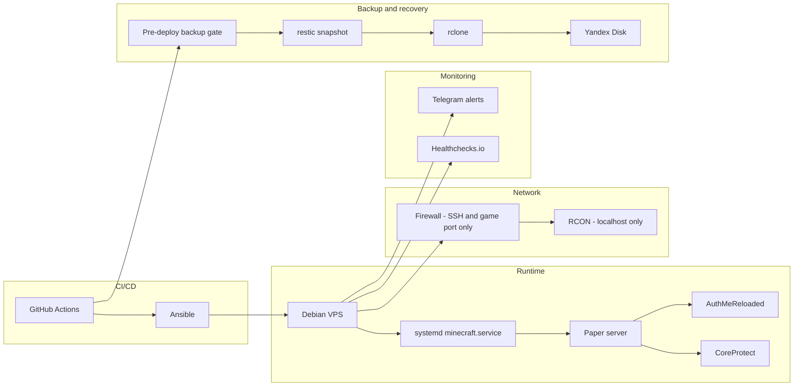

## Context

A private Minecraft server for friends still needed real operational discipline: safe deploys, backups that actually restore, and alerts when something breaks, without infrastructure the project didn't need.

## Constraints

No Docker or Kubernetes, no public RCON, and no secrets, worlds, or backups in Git. A failed pre-deploy backup blocks the deploy. Player identities, whitelist contents, the VPS address, and exact file paths are not part of the public case.

## Architecture Summary

A single Debian VPS runs Paper as a native systemd service, with AuthMeReloaded for login and CoreProtect for rollback logging. Ansible provisions the host; GitHub Actions validates and deploys. Backups run through restic and rclone to Yandex Disk, with Telegram and Healthchecks.io covering monitoring and alerting.

## Actions

- Built Ansible playbooks that provision the VPS and configure the Paper service end to end.
- Built a GitHub Actions pipeline that validates, provisions, and deploys, gated on a successful pre-deploy backup.
- Set up restic and rclone backups to Yandex Disk and exercised a full restore against a real snapshot.
- Added Telegram and Healthchecks.io alerting, including a direct alert on backup failure.
- Added release management that prunes old releases while protecting the current and previous release.

## Results

- The full pipeline, provision, deploy, backup, and verify, runs end to end without manual steps.
- A real restore was tested and confirmed to preserve player accounts and the whitelist.
- Failures reach a person directly instead of failing silently.
- Deploys cannot proceed on a failed backup, removing a class of data-loss risk.

## Safety Note

This case intentionally omits the VPS address, player identities and whitelist contents, secret names and values, and exact file paths.
