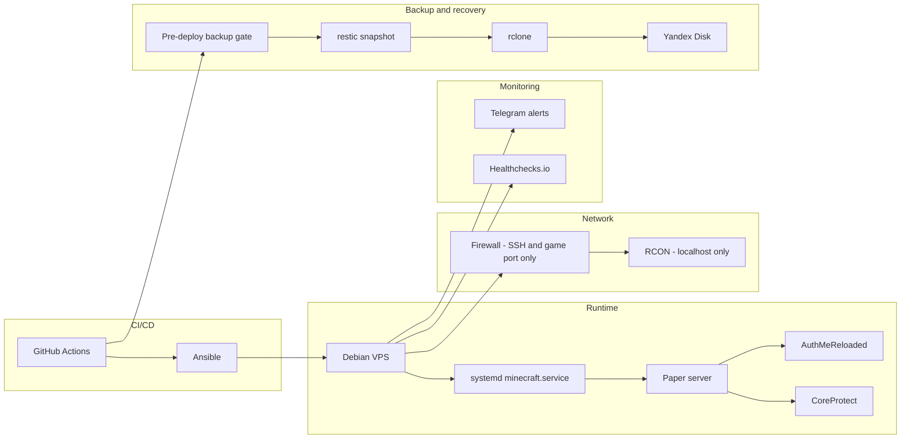

## Контекст

Приватному Minecraft-серверу для друзей всё равно нужна реальная операционная дисциплина: безопасные деплои, бэкапы, которые действительно восстанавливаются, и алерты, когда что-то ломается, без лишней инфраструктуры, которая проекту не нужна.

## Ограничения

Без Docker и Kubernetes, без публичного RCON, без секретов, миров и бэкапов в Git. Упавший pre-deploy backup блокирует деплой. Никнеймы игроков, содержимое whitelist, адрес VPS и точные пути к файлам не входят в публичный кейс.

## Архитектура

Один Debian VPS запускает Paper как нативный systemd-сервис, с AuthMeReloaded для логина и CoreProtect для rollback-логирования. Ansible провижинит хост; GitHub Actions валидирует и деплоит. Бэкапы идут через restic и rclone в Yandex Disk, а Telegram и Healthchecks.io закрывают мониторинг и алертинг.

## Действия

- Собрал Ansible playbooks, которые провижинят VPS и настраивают Paper-сервис end-to-end.
- Собрал GitHub Actions pipeline, который валидирует, провижинит и деплоит, с гейтом на успешный pre-deploy backup.
- Настроил restic и rclone бэкапы в Yandex Disk и прогнал полный restore на реальном снапшоте.
- Добавил алертинг через Telegram и Healthchecks.io, включая прямой алерт при падении бэкапа.
- Добавил release management, который чистит старые релизы, защищая текущий и предыдущий.

## Результаты

- Весь pipeline — provision, deploy, backup, verify — проходит end-to-end без ручных шагов.
- Реальный restore проверен и подтвердил сохранность аккаунтов игроков и whitelist.
- Сбои доходят до человека напрямую, а не теряются молча.
- Деплой не может пройти при упавшем бэкапе — это убирает целый класс риска потери данных.

## Safety Note

Кейс намеренно не раскрывает адрес VPS, никнеймы игроков и содержимое whitelist, имена и значения секретов, а также точные пути к файлам.
